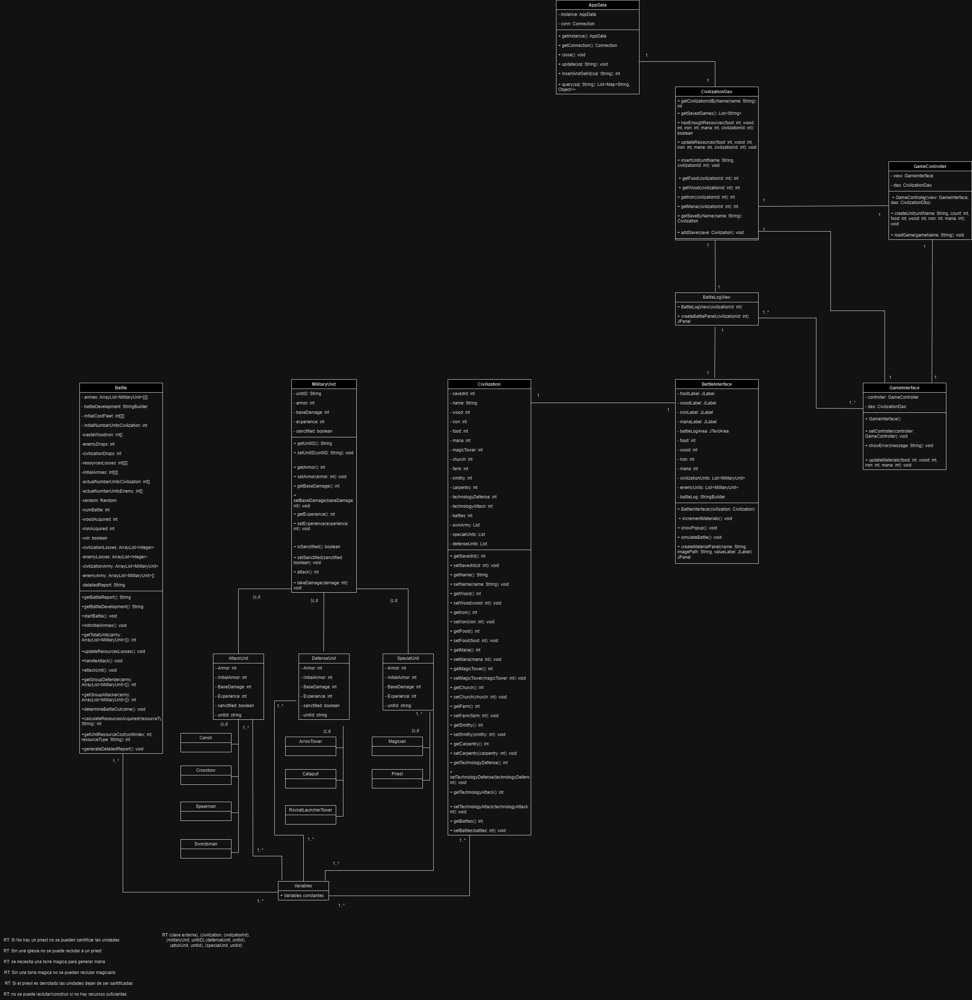

# Nombre del Proyecto

Una breve descripción del proyecto, explicando su propósito y objetivos principales.

# Use To Code


## Tabla de Contenidos

- [UML](/M5)
- [Base de Datos](#base-de-datos)
- [Programación](#programación)
- [Web](#web)

## UML

Incluir diagramas UML que describen la estructura y el diseño del sistema. 



## Base de Datos

Descripción de la estructura de la base de datos, esquemas, y cómo se gestionan los datos. Puedes incluir diagramas ER y scripts SQL.

```sql
CREATE TABLE civilization_stats
(
  civilization_id NUMBER(10) NOT NULL PRIMARY KEY,
  name VARCHAR2(50),
  wood_amount NUMBER(10) ,
  iron_amount NUMBER(10) ,
  food_amount NUMBER(10) ,
  mana_amount NUMBER(10), 

  magicTower_counter NUMBER(10), 
  church_counter NUMBER(10), 
  farm_counter NUMBER(10), 
  smithy_counter NUMBER(10), 
  carpentry_counter NUMBER(10), 

  technology_defense_level NUMBER(3),
  technology_attack_level NUMBER(10), 
  battles_counter NUMBER(10) 
);

CREATE TABLE attack_units_stats
(
  civilization_id NUMBER(10) NOT NULL, 
  unit_id VARCHAR2(50) NOT NULL,
  type_unit VARCHAR2(10), 
  armor NUMBER(10),
  base_damage NUMBER(10), 
  experience NUMBER(10),
  sanctified VARCHAR2(3), 
  FOREIGN KEY (civilization_id) REFERENCES civilization_stats(civilization_id),
  CONSTRAINT pk_civi_unit PRIMARY KEY (civilization_id, unit_id),
  CONSTRAINT tipesunit CHECK(type_unit IN('Swordsman', 'Spearman', 'Crossbow', 'Cannon'))
);

CREATE TABLE special_units_stats
(
  civilization_id NUMBER(10) NOT NULL, 
  unit_id VARCHAR2(50),
  type_unit VARCHAR2(10), 
  armor NUMBER(10),
  base_damage NUMBER(10), 
  experience NUMBER(10),
  FOREIGN KEY (civilization_id) REFERENCES civilization_stats(civilization_id),
  CONSTRAINT pk_primary_special PRIMARY KEY (civilization_id, unit_id),
  CONSTRAINT typeunitspecial CHECK(type_unit IN('Magican', 'Priest'))

);

CREATE TABLE defense_unit_stats
(
  civilization_id NUMBER(10) NOT NULL, 
  unit_id VARCHAR2(50),
  type_unit VARCHAR2(10), 
  armor NUMBER(10),
  base_damage NUMBER(10), 
  experience NUMBER(10),
  sanctified VARCHAR2(3),
  FOREIGN KEY (civilization_id) REFERENCES civilization_stats(civilization_id),
  CONSTRAINT pk_primary_defense PRIMARY KEY (civilization_id, unit_id),
  CONSTRAINT type_unit_defense CHECK (type_unit IN('ArrowTower', 'Catapult','RocketLauncherTower'))
);

CREATE TABLE battle_stats (
    civilization_id NUMBER(5) NOT NULL,
    num_battle NUMBER(5) NOT NULL,
    wood_acquired NUMBER(5),
    iron_acquired NUMBER(5),
    CONSTRAINT pk_battle_stats PRIMARY KEY (civilization_id, num_battle),
	FOREIGN KEY (civilization_id) REFERENCES civilization_stats(civilization_id)
);
CREATE TABLE civilization_attack_stats (
    civilization_id NUMBER(5) NOT NULL,
    num_battle NUMBER(5) NOT NULL,
    type_stats VARCHAR(50),
    initial_stats NUMBER(5),
    drops NUMBER(5),
    CONSTRAINT pk_civilization_attack_stats PRIMARY KEY (civilization_id, num_battle, type_stats),
    FOREIGN KEY (civilization_id, num_battle) REFERENCES battle_stats(civilization_id, num_battle)
);

CREATE TABLE civilization_defense_stats (
    civilization_id NUMBER(5) NOT NULL,
    num_battle NUMBER(5) NOT NULL,
    type_stats VARCHAR2(50),
    initial_stats NUMBER(5),
    drops NUMBER(5),
    CONSTRAINT pk_civilization_defense_stats PRIMARY KEY (civilization_id, num_battle, type_stats),
    FOREIGN KEY (civilization_id, num_battle) REFERENCES battle_stats(civilization_id, num_battle)
);

CREATE TABLE civilization_special_stats (
    civilization_id NUMBER(5) NOT NULL,
    num_battle NUMBER(5) NOT NULL,
    type_stats VARCHAR(50),
    initial_stats VARCHAR2(50),
    drops VARCHAR(50),
    CONSTRAINT pk_civilization_special_stats PRIMARY KEY (civilization_id, num_battle, type_stats),
    FOREIGN KEY (civilization_id, num_battle) REFERENCES battle_stats(civilization_id, num_battle)
);

CREATE TABLE battle_log (
    civilization_id NUMBER(5) NOT NULL,
    num_battle NUMBER(5) NOT NULL,
    num_line NUMBER(5) NOT NULL,
    log_entry VARCHAR2(50),
    CONSTRAINT pk_battle_log PRIMARY KEY (civilization_id, num_battle, num_line),
    FOREIGN KEY (civilization_id, num_battle) REFERENCES battle_stats(civilization_id, num_battle)
);

CREATE TABLE enemy_units_stats (
    civilization_id NUMBER(10) NOT NULL,
    unit_id VARCHAR2(50) NOT NULL,
    type_unit VARCHAR2(50),
    armor NUMBER(10),
    base_damage NUMBER(10),
    experience NUMBER(10),
    sanctified VARCHAR2(3),
    PRIMARY KEY (civilization_id, unit_id)
);

CREATE SEQUENCE civilization_seq START WITH 1 INCREMENT BY 1;

CREATE OR REPLACE TRIGGER civilization_before_insert
BEFORE INSERT ON civilization_stats
FOR EACH ROW
BEGIN
  IF :NEW.civilization_id IS NULL THEN
    SELECT civilization_seq.NEXTVAL INTO :NEW.civilization_id FROM dual;
  END IF;
END;

